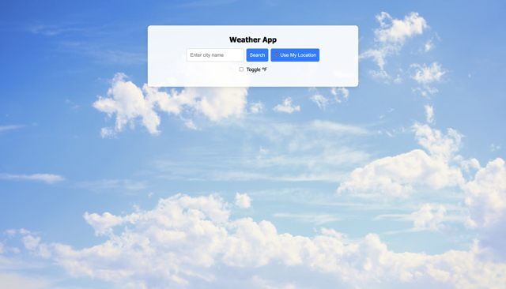
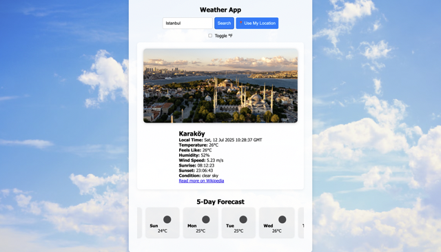

# 🌤 Enhanced Weather App

A sleek and fully-featured weather web application built using **HTML**, **CSS**, and **JavaScript** that fetches live weather data using the [OpenWeather API](https://openweathermap.org/api).

This project includes modern UI/UX enhancements and 8 advanced features, making it ideal for weather tracking, portfolio showcasing, or web development practice.

---

## 🚀 Features

- 🔍 **Search by City** — Get live weather for any city worldwide
- 📍 **Geolocation Support** — Use your current location to fetch weather
- 🌐 **Wikipedia City Landmark** — Displays a relevant city image via Wikipedia
- 🧠 **Smart Error Handling** — Feedback for invalid searches or location access
- 🌤 **5-Day Forecast** — Horizontally scrollable forecast with temperature & icon
- 🌡 **°C / °F Toggle** — Instantly switch between Celsius and Fahrenheit
- 🌅 **Local Time + Sunrise/Sunset** — Accurate data from user location
- 🖼 **Background Image** — Custom aesthetic background (not weather-based)

---

## 🧰 Tech Stack

- **Frontend:** HTML5, CSS3 (Flexbox), Vanilla JavaScript (ES6+)
- **API:** [OpenWeather Current + Forecast APIs](https://openweathermap.org/api)
- **Image Source:** Wikipedia API (PageImages)

---

## 📷 Screenshots

| Search Example       | Forecast Example        |
|----------------------|-------------------------|
|  |  |


---

## 🛠 How to Run Locally

1. **Clone the repository**
   
```bash
   git clone https://github.com/ShashankGoutam/Weather_App.git
   cd weather-app
```

2. **Add your API key**

Open script.js and replace:
   
```bash
let apiKey = "YOUR_API_KEY";
```

with your personal OpenWeather API key.

3. **Open the app**

In VSCode: Right-click index.html → Open with Live Server (recommended)

Or open it directly in a browser.

---

## 🌍 Deployment 

App will be live at: https://shashankgoutam.github.io/Weather_App/

